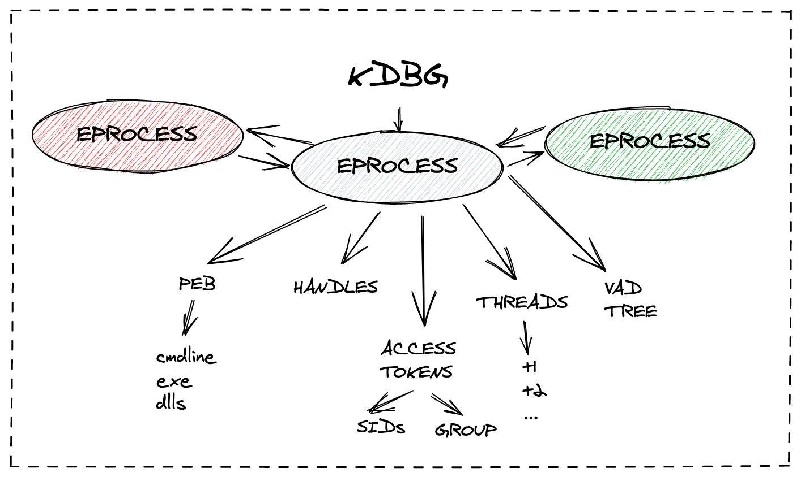

# Advanced Incident Response & TH

## Introduction to IR & TH

* O tym, że scoping został odpowiednio przeprowadzony i nie trzeba go poszerzać decyduje mała pętla (**Incident Response Detection and Intelligence Loop**). Polega ona na powtarzaniu faz _identification and scoping_ i _containment/intelligence development_ i poszerzaniu informacji na temat skompromitowanych zasobów.
* Kluczowym jest aby **nie rozpocząć remediacji bez pełnego scopingu**, tak aby odebrać atakującemu kontrolę permanentnie.
* Aby kupić czas na scoping, można stosować techniki zwodzenia i zwalniania przeciwnika (w ramach containmentu) np. traffic shaping, tarpiting, bit mangling, okna serwisowe. 

## IR & TH

##  Malware-ology

* Malware (a raczej narzędzia "tool") nie może jednocześnie działać (realizować swoje funkcje) i pozostawać w ukryciu (sprzeczność)
* Wyróżnia się 3 stany maszyn, które były/są zainfekowane: 1. te z **aktywnym malware** 2. te, które **były aktywnie wykorzystane ale ślady zostały zatartę** przez intruza lub czas (późne wykrycie) 3. te, na których **nie wykorzystywano złośliwego oprogramowania** a raczej LOLBASy
* Powershell jest świetnym przykładem oprogramowania, które spełnia wymogi nawet wytrawnych adwersarzy sprawiając, że nie muszą oni umieszczać własnych tooli
* Maszyny 3 typu (na których nie wykorzystano zł.opr.) jest bardzo trudno wykrywać - potrzebny dobry EDR/analiza telemetrii, ewentualnie pełny (deep-dive) DF.
* Cyfrowe podpisy binarek są problemem dla grup APT, bo trudno jest zapewnić odpowiednią ilość certyfikatów dla różnych wersji binarek a przecież nie podpiszą wszystkich jednym certem aby nie ułatwić DFIR.
* **96% złośliwego oprogramowania nie jest podpisane cyfrowo.**

## Malware persistence

* adwersarze nie chcą nam zaimponować, tylko najłatwiej osiągnąć swoje cele, dlatego często wykorzystują pospolite techniki utrzymania przyczółka (ang. _foothold_)
* **rejestr** - najbardziej pospolity, są 2 główne klucze (Run), które są wykorzystywane najczęściej
* **usługi Windows** - często używane ponieważ startują automatycznie, bez interakcji użytkownika i na wysokich uprawnieniach. Usługa nie musi być utworzona - niektóre grupy modyfikują już istniejące, albo wykorzystuje się mechanizm **Service Failure Recovery** do uruchomienia binarki po crashu usługi. `Get-SvcFail.ps1` z Kansy[^1] zbiera informacje dot. SFR.
* **Ponad 80% tooli wykorzystuje do persystencji rejestr lub usługi**.
* **Scheduled Tasks** - `at.exe` już niewspierane w Win10. `schtasks.exe` zostawia bardzo dużo artefaktów.
* **DLL** - dość ciche (trudniejsze do wykrycia), wykorzystywane na 3 sposoby: 1. **search order hijack** (umieszczenie dllki w ścieżce o wyższym priorytecie) 2. **phantom dll hijack** (podrzucenie dllki, która jest wczytywana a której nie ma w systemie) 3. **dll side-loading** przy użyciu folderu `WinSxS` (można wymusić wczytanie "nowej wersji" dllki, mimo że oryginalna znajduje się w systemie)[^2]
* **WMI** - `Binding` tworzy powiązanie pomiędzy `Event Filter` (triggerem) a `Event Consumer` (aplikacją/skryptem uruchamianym). Triggerów są tysiące w Windowsie - np. kiedy użytkownik się zaloguje, lub utworzony zostanie jakiś plik/folder. Bardzo mało hałaśliwa technika persystencji. **Jeśli autoruns pokazuje jakiś wpis z WMI to jest to wysoce podejrzane!**.

## Incident Response and Hunting Across the Enterprise

* Skalowanie IR jest trudne. Tendencja bat -> wmi -> ps
* Powershella trzeba się nauczyć![^3]
* Powershell-remoting wydaje się najwygodniejszy a przy okazji łącząc się z przejętą stacją **nie ryzykujemy ujawnienia własnych poświadczeń** (**nondelegated Kerberos**)
* Powershell-remoting ogarnia też przetwarzanie na endpointach, dlatego dobrze się skaluje z punktu widzenia IR (np. zwróć wyniki tylko ze stacji na której występuje konkretny użytkownik).
* Kansa może wysłać binarkę (np. `autorunsc.exe`) i zwrócić wyniki w formie obiektu PS.
* Kansa po zebraniu dużej ilości danych ma **skrypty do obróbki danych**. Przede wsystkim _stacking_ (najrzadziej występujące wyniki spośród dużego zbioru). Najbardziej generyczny to `Get-LogparserStack.ps1`.
* Warto rozkminić `logparser.exe` - darmowe od microsoftu, pozwala odpalać sqlki na logach.
* Poruszony **temat Rootkitów** - zazwyczaj wpływają na WinAPI tak, aby coś ukryć. Rzadko stosowane z powodu ryzyka, że spowodują niestabilność systemu. W celu ujawniania najlepiej wykonać analizę pamięci (z Kansy: `Get-RekalPslist.ps1`).

## Investigating WMI Attacks

* Dużo technik APTowych jest realizowanych przy pomocy WMI, lub WMI za pośrednictwem Powershella. Szczególnie często wykorzystuje się WMI do rekonu, privesc, lm. Warto przejrzeć PowerUpa, gdzie są ciekawe techniki znajdowania privesc w systemie.[^4]
* Mniej hałaśliwy odpowiednik Psexeca: `wmic PROCESS CALL CREATE <path>`. Odpalanie zdalne: parametr `/node`.
* **Audytowanie linii poleceń absolutnie niezbędne** do wykrywania zaawanoswanych ataków (z wykorzystaniem WMI i nie tylko).
* Dobrym początkiem huntu na WMI (persystencję) jest szukanie nietypowych `__EventConsumers` - tam w polu `commandline templates` może czaić się zło.
* Baza WMI jest w `\Windows\System32\wbem\Repository\`. Można ją badać offlineowo (plik: `OBJECTS.DATA`) w ramach forensica. Np. przy użyciu `PyWMIPersistenceFinder.py`[^5]
* Spośród 6 rodzajów Event Consumerów, interesujące są (z punktu widzenia persystencji) 2: 1. `ActiveScriptEventConsumer` - odpala VB/JS 2. `CommandLineEventConsumer` - odpala dowolną binarkę.
* **Pliki MOF** (Managed Object Format) mogą być używane do tworzenia nowych definicji i instancji klas. Kompilator `mofcomp.exe` (zdalnie: `-N`) kompiluje tekstowy plik `.MOF`, który można następnie skasować.
* Plik MOF będzie prawdopodobnie zawierał instrukcję `#PRAGMA AUTORECOVER`, która backupuje plik w celu jego zachowania przy następnym odbudowywaniu repozytorium WMI. To **pozostawia ślad do forensica** (**system plików**: `Windows\System32\wbem\AutoRecover` oraz **rejestr**: `HKLM\SOFTWARE\Microsoft\Wbem\CIMOM`, nazwa klucza: `Autorecovery MOFs`). Jeśli nie będzie zawierał tej instrukcji to po rebuildzie przestanie działać (zostanie usunięty).
* Procesy uruchamiane przez **WMI zawsze mają parent process**: 1. `wmiprvse.exe` (`CommandLineEventConsumer`) lub 2. `scrcons.exe` (`ActiveScriptEventConsumer`) , co ułatwia hunting.

# Intrusion Analysis

## Credential Theft

* Poruszanie się po Windowsie wymaga zdobycia jakiś poświadczeń, więc zawsze na pewnym etapie adwersarz po nie sięgnie. To dobry powód do ich ochrony i monitorowania. 
* **Kradzież poświadczeń ułatwia scoping**, ponieważ można szukać anomalii poprzez szukanie wykorzystania skompromitowanych poświadczeń w logach.
* Microsoft zbackportował różne techniki mitygacji z Win8 i 8.1 do Win7 w ramach KB2871997 (na przykład _Protected Processes_)
* W Win8 **ograniczono możliwości wykorzystania lokalnego konta Administratora w celu nawiązywania połączeń zdalnych**, dzięki czemu utrudniono Lateral Movement przy użyciu tego konta.
* Jedną z ciekawszych mitygacji w Win8 jest **Domain Protected Users Security Group**.
* W przypadku zdalnych sesji istotny jest **Logon Type**. Jeśli 2 (np. RunAs) lub 10 (np. RDP) to **poświadczenia lądują na docelowej maszynie i są podatne na dumpowanie**. Dlatego **warto korzystać z PS-Remoting** (LogonType=3). **(Remote) Credential Guard** mityguje ten problem.
* **Tokeny Windowsa** - każdy proces posiada jakiś token (kontekst bezpieczeństwa). Przy użyciu `SeImpersonate` można przechwycić taki token z dowolnego aktualnie uruchomionego procesu. **Delegate Token** to forma tokenu, którą można wykorzystywać zdalnie (SSO). Mimikatz potrafi wykonać to automatycznie przy użyciu komendy: `token::elevate /domainadmin`. Aby zapobiegać należy uniemożliwić delegacje tokenu _token cannot be delgated_ lub dodać do grupy _Domain Protected Group_.
* **Cached Credentials** - Windows zapamiętuje **10 haszy logonowych** (z ostatnio zalogowanych 10 kont - można tą wartość zmienić w rejestrze) w celu możliwości logowania się offline (bez dostępu do AD). Często wśród tych 10 są cenne konta. Poświadczenia zapisane są **w formie osolonych haszy** (trudno crackować, nie możliwy PtH). **Domain Protected Users** się nie cachują.
* **LSA Secrets** - przechowywane w formie zaszyfrowanej razem z kluczami w pamięci lsass.exe - można zdobyć hasła plaintextowe. **Również sekrety kont serwisowych** (dla usług). Jeśli uda się zrobić elewację do SYSTEM to można wyciągnąć nie tylko mimikatzem ale też Powershellem.[^6]
* Skoro konta serwisowe są tak chętnie wykorzystywane przez adwersarzy to idealnie by było je monitorować (np. kto się loguje RDPowo przy użyciu takiego konta).
* **Kerberos** - tickety są cachowane w pamięci na 10 godzin (potem można wyrobić kolejny). Ogromna ilość ataków i skomplikowanie implementacji. 1. Pass the Ticket 2. Overpass the Hash (pozwala zażądać wydanie ticketu (np. konta usługi) na podstawie Hasha NT) 3. Kerberoasting 4. Golden Ticket 5. Silver Ticket (niby ważny 30 dni, ale można w rejestrze wyłączyć odświeżanie) 6. Skeleton Key - patchowanie lsass.exe na kontrolerze domeny - pozwala dodać backdoora i zapasowe hasło do każdego konta, które przeżyje reset 7. DCSync
* Najlepsza mitygacja na te ataki to separation of duty - konta workstation admina - dla stacji roboczych, server admina dla serwerów, a AD admin dla AD - w ten sposób poświadczenia nie zostają na innych systemach!!
* **NTDS.dit** - Baza AD (szyfrowana ale łatwa do złamania). znajduje się w `Windows\NTDS\`. Zabezpieczona przed odczytem, więc trzeba użyć volume shadow copy.
* **Wykrywanie credential theftu jest trudne** (szczególnie golden/silver ticket etc.). Dobrze jest się skupić na uruchamianych procesach (_Execution_)
* **Prefetch** zapisuje info o uruchomieniach procesów w celach poprawy wydajności. Domyślnie włączony na wszystkich windowsach poza serwerowymi. Zapisywane w `\Windows\Prefetch` w formie `<exe-name>-<hash based on path>` - **tylko na stacjach roboczych (nie na serwerach)**. W Win8+ 1024 ostatnio uruchamianych procesów. W Win10 skompresowane. Data utworzenia i modyfikacji pliku wskazują na pierwsze i otatnie uruchomienie konkretnego procesu (**-10 sekund**). Ilość uruchomień zapisana w pliku. Do parsowania można użyć PEcmd.exe[^7].
* Dodatkową zaletą prefetcha jest to, że rejestruje przez 10 sekund inne pliki/foldery, które były "dotykane" podczas uruchomienia binarki. W tym wypadku artefaktami mogą być np. dokumenty worda, albo archiwa (widać pełne ścieżki i nazwy plików).
* **ShimCache** - Można znaleźć informacje dot. binarek na dysku, a szczególnie w folderach przeglądanych przez eksplorator. Niestety w różnych wersjach windowsa, shimcache zapisuje różne rzeczy. W Win10 nie ma już informacji czy było uruchamiane. Windows zapisuje dane selektywnie i trudno ocenić ich kompletność. Tylko WinXP zapisuje ostatnie uruchomienie. Jest tool[^8].
* **AmCache.hve** - Kompletny (osobny) hive: `Windows\AppCompat\Programs\Amcache.hve`, dostępny na Win7-10 (zbackportowany z Win8). Zawiera bardzo dużo informacji o systemie, aplikacje, sterowniki, ale **nie da się ustalić czy były uruchamiane**. Informacje są bardzo szczegółowe (**hasze SHA1**, wielkość pliku, ścieżka, modyfikacja, data kompilacji, publisher).  Zawartość hive'a różni się bardzo pomiędzy wersjami Windows, ale najważniejsze klucze to **InventoryApplication**, **InventoryApplicationFile** a dla sterowników **InventoryDriverBinary**. Tak dużo danych dobrze jest przeglądać odpowiednim toolem[^9].
* Fajnym trikiem AmCache'a jest przeglądanie binarek, które nie mają skojarzenia z zainstalowanymi aplikacjami (klucz w `InventoryApplicationFile` ale brak w `InventoryApplication`). Można takie podejrzeć w pliku `xxx_Amcache_UnassociatedFileEntries.csv` - output z toola.
* Dobrze jest grupować i stakować razem dane o uruchomieniu przy użyciu wygodnego narzędzia[^10].

## Event Log Analysis for Responders and Hunters

* Logi Windows (`.evt` - `%systemroot%\System32\config` do WinXP/2K3, `.evtx` - `%systemroot%\System32\winevt\logs` - wszystkie po XP). **Ścieżkę logowania można zmienić**. 
* **Security** - jego jakość zależy od _audit policy_. **Zdarzenia generowane są wyłacznie przez proces** `lsass.exe`. 
* Zdarzenia logowania do systemu - Polę `Logon Type` odpowiada za rodzaj logowania (istotne z punktu widzenia bezpieczeństwa poświadczeń). Polę `Logon ID` może być wykorzystane do korelacji sesji, co pozwala ocenić jak długo użytkownik był zalogowany.
* **Zdarzenia związane z kontami wbudowanymi** _Built-in accounts_, **(raczej) nie są podejrzane** (Network Service, Local Service, _Computer_$, SYSTEM). Warto skupić się na kontach użytkowników.
* Ciekawym pomysłem jest śledzenie utworzenia kont. W organizacji zazwyczaj powinny być tworzone przez określone konto, w określonym czasie (np. pod koniec miesiąca). Odstępstwa od tego, mogą być ciekawym sposobem monitorowania podejrzanych zdarzeń.
* Trzeba pamiętać, że **rozłączenie sesji RDP, nie musi powodować wylogowania użytkownika** i rejestrować tego faktu w logach. Dlatego ważnym jest żeby monitorować logi RDP (poza security), ale w poszczególnym wersjach Windowsa zmienia się ich nazwa i format...
* W logach RDP pojawiają się czasami informacje wysyłane przez klienta dot. środowiska. Dzięki temu można wykrywać anomalie (nazwa hosta, układ klawiatury).
* **Logi RDP** na stacjach roboczych mają zazwyczaj **mało zdarzeń i bardzo rzadko się rotują**.
* Log `TerminalServices-RDPClient` jest **jedynym logiem**, w którym można znaleźć informacje o **połączeniach RDP wychodzących z hosta**. Wszystkie inne logi są tworzone na hoście docelowym i mają informacje o połączeniach przychodzących (a ten odwrotnie). Warto też pamiętać, że artefakty związane z wychodzącymi połaczeniami RDP (wraz z nazwą usera) znajdują się w rejestrze użytkownika.
* Logon Event - zdarzenie uwierzyteleniania (+ autoryzacji chyba) (znajduje się zazwyczaj tam, gdzie dokonywane jest uwierzytelnienie, więc dla kont domenowych na kontrolerach). W tym wypadku jest informacja o tym jaki rodzaj uwierzytelnienia (ntlm/kerberos) i jaki był powód błędu (np. konto nie istnieje).
* Zdarzenie enumeracji grup (id:`4799`) może służyć do monitorowania aktywności związanej z rekonesansem (_bloodhound_, _powerview_). Zdarzenie zawiera informacje o tym, jaki użytkownik enumerował jaką grupę.
* Do analizy Windows Event Log nie ma sensu wykorzystywać wbudowanego event log viewera, tylko inne toole GUIowe[^11] i CMDlineowe[^12]. Szczególnie ten drugi wydaje się przydatny bo są gotowe, crowdsourceowe mapowania do różnych typów logów (yaml).
* **Lateral Movement** oparty o scheduled tasks pozostawia ślady w logu `Security`(utworzenie, modyfikacja, skasowanie taska), jak również w `Task scheduler log` (uruchomienie/włączenie/wyłączenie zadania). Zdalnie wykonany scheduled task pozostawia również zdarzenie zalogowania (`4624` - `logon type=3`). W Windows 10, polityka logowania **może domyślnie nie logować zdarzeń** związanych z wykonywaniem zadań. Zdarzenia są zapisane w formacie XML w `Windows\System32\Tasks`.
* Zdarzenia dot. usług też warto przeglądać - szczególnie zdarzenie zainstalowania nowej usługi w systemie (`System log: 7045` i `4697`) - pozwala wykryć na przykład PSexeca. Zdarzenie `7034` jest logowane podczas crashu usługi - to może wskazywać na nieudane wstrzyknięcie kodu.
* Czyszczenie logów pozostawia 2 eventy (`Security log: 1102` i `System log: 104`). Czyszczenie najczęściej jest przeprowadzone 1. z GUI (event viewer) 2. Powershellem 3. `wevtutil.exe`.
* Pojawiły się również sposoby **selektywnego "ukrywania" niektórych zdarzeń** w dzienniku zdarzeń (`DanderSpritz eventlogedit`) oraz **zabijania/patchowania w pamięci** procesów/wątków odpowiedzialnych za zapisywanie logów (Mimikatz `event::drop`, `Invoke-Phant0m`).

| Event ID  | Opis                                                                   | Uwagi                                                                          |
|-----------|------------------------------------------------------------------------|--------------------------------------------------------------------------------|
|           | Security.evtx                                                          |                                                                                |
| 4624      | Succesful Logon                                                        | LogonType: 2 (konsola), 10 (RDP) - można dump. 3 (PS-Remote/Net) - niepodatne. |
| 4625      | Failed Logon                                                           | jest reason! Jeśli duży wolumin to brute-force                                 |
| 4634/4647 | Successful Logoff                                                      | często zawodzi                                                                 |
| 4648      | Logon using explicit credentials (RunAs)                               |                                                                                |
| 4672      | Account logon with superuser rights (Admin)                            | interesujące/podejrzane kiedy jest na stacji                                   |
| 4720/4726 | Account created/deleted                                                |                                                                                |
| 4722      | User account enabled                                                   |                                                                                |
| 4728      | Member added to security-enabled global gr                             |                                                                                |
| 4732      | Member added to security-enabled local gr                              |                                                                                |
| 4738      | User account changed                                                   |                                                                                |
| 4756      | Member added to security group                                         |                                                                                |
| 4776      | Successful/Failed account auth                                         | NTLM                                                                           |
| 4768      | TGT granted (successful logon)                                         | Kerberos                                                                       |
| 4769      | Service Ticket requested                                               | Kerberos                                                                       |
| 4771      | Pre-authentication failed                                              | Kerberos                                                                       |
| 4778      | Session Reconnected (RDP)                                              | występują ciekawe dane (IP, nazwa klienta)                                     |
| 4779      | Session Disconnected (RDP)                                             |                                                                                |
|           | MS-Windows-TerminalServices-RDPClient \ Operational.evtx               | Logi występują na maszynie źródłowej!                                          |
| 1024      |                                                                        | występuje dest hostname                                                        |
| 1102      |                                                                        | występuje dest ip                                                              |
|           | MS-Windows-TerminalServices-RemoteConnectionManager \ Operational.evtx | Logi występują na maszynie docelowej!                                          |
| 1149      |                                                                        | Src IP + username                                                              |
|           | MS-Windows-RemoteDesktopServices-RDPCoreTS \ Operational.evtx          | Logi występują na maszynie docelowej!                                          |
| 131       | Connection Attempts                                                    | SRC IP + username                                                              |
| 98        | Successful Connections                                                 |                                                                                |
|           | MS-Windows-TerminalServices-LocalSessionManager \ Operational.evtx     | Logi występują na maszynie docelowej!                                          |
| 21,22,25  |                                                                        | Src IP + username                                                              |
| 41        |                                                                        | username                                                                       |

## Lateral Movement Adversary Tactics
* **RDP** - Raczej artefakty związane z LM odkładają się na systemie docelowym (chociaż na źródłowym czasami też). Warto pamiętać o shim/am/pf, który może odłożyć informacje o uruchomieniu `rdpclip.exe` lub `tstheme.exe`, które wskazują na to, że ktoś się RDPował do tego systemu.
* **Windows Share/Admin Share** - sytuacja podobna jak z RDP. Można obserwować uruchomienie `net.exe` i `net1.exe`. W rejestrze widać mountpointy. Shellbags - plik `USRCLASS.DAT` zawiera informacje o odwiedzanych folderach sieciowych (podczas sesji interaktywnej).
* **Zdalne uruchomienie - PSexec** - zostawia bardzo dużo artefaktów (uwierzytelenienie, named pipe, zamontowanie udziału `ADMIN$`, skopiowanie pliku `PsExeSvc.exe` do katalogu Windows (+ uruchamiana binarka), instalacja i uruchomienie usługi `PSEXESVC`). 
* **Zdalne uruchomienie - Toole Windows** - Windows zawiera wiele tooli umożliwiających zdalne wykonanie - `sc \\host create servicename binpath=`, `sc \\host start servicename`,`at \\host`, `schtasks /CREATE /s <host>`, `reg add \\host\HKLM\...\Run` i bardzo rzadkie: `winrs -r:host -u:user command`. Jak zwykle większość artefaktów pozostanie na systemie docelowym.
* **Zdalne uruchomienie - WMI** - najbardziej wyrafinowane (najchętniej wykorzystywane). Na systemie docelowym pozostaje artefakt po uruchomionym `wmiprvse.exe`. Może również pozostać consumer. Log `Microsoft-Windows-WMI-Activity/Operational` ma zmienić zasady gry.
* **Zdalne uruchomienie - PS** - zazwyczaj polega na `Enter-PSSession` i `Invoke-Command`. Na systemie docelowym uruchomiony zostaje `wsmprovhost.exe`.
* **Zdalne uruchomienie - Application Deployment Software** - zawsze można użyć WSUSa lub jakiś panel chmurowy, aby oddziaływać na środowisko w określony sposób.
* **Zdalne uruchomienie - poprzez exploit usługi lub aplikacji** - najrzadziej, ale jednak, zdarzają się LM oparte o exploit - na przykład EternalBlue, albo Shellshocka, albo w ogóle RCE w aplikacji webowej. **Rzadko pozostawiają ślady** w domyślnych politykach logowania (audit logu).

## Command Line, PowerShell, and WMI Analysis

* Dobre logowanie PS pojawiło się w PS v. 5.0.
* Napastnicy lubią downgradeować PS do niższej wersji, aby uniknąć mechanizmów bezpieczeństwa.
* Log powershella zapisuje treść całego bloku tylko raz (w przypadku powtarzających się skryptów, dane nie są powielane). 
* Rekomenduje się retencję na poziomie 1GB (na Powershell event log) - 6-12 miesięcy retencji.
* Microsoft zaimplementował blocklistę, która nie jest jawna, ale może **zalogować podejrzane skrypty nawet pomimo domyślnie wyłączonego SBL**. Takie zdarzenie odłoży się jako `event id: 4104 level=warning` (if warning then malicious).
* **Powershell transcript** - zapisuje wszystko to co dzieje się w konsoli PS. Domyślnie wyłączony, dostępny od PS v.4. Niestety domyślnie zapisuje do folderu dokumentów użytkownika w formie plików tekstowych. Należy to zmienić na inny folder z prawami tylko do zapisu.
* **Historia konsoli** - zapisywana w `%AppData%\Roaming\Microsoft\Windows\PowerShell\PSReadline` - zawiera 4096 ostatnio wydawanych poleceń. Można to wyłączyć.
* **WMI** - logowanie uboższe niż w przypadku PS, ale ostatnio pojawił się `WMI-Activity/Operational event id: 5861` (nowy wmi consumer).
* Slajd 22 (Event Log Summary) - **świetny cheatsheet** z listą logów i event id do zbierania (inwestygacji).
* Świetnym narzędziem do inwestygacji logów jest PowerShell - `Get-WinEvent -ComputerName/-Logname/-Path` - w zależności czy zdalnie czy lokalnie. Dobry przykład: `Get-WinEvent -FilterHashtable @{Path="C:\path\to\security*.evtx";id=5140} | Where {$_.Message -match "\\Admin\$"}` Dodatkowo jeszcze istnieje switch `-ConvertTo-CSV/HTML`.
* Microsoft udokumentował logi w dokumencie worda... Są też inne wartościowe adresy[^13][^14][^15].

# Memory Forensics in Incident Response and Threat Hunting

## Triage and EDR

* nic ciekawego

## Memory Forensics
* nic ciekawego

## Acquiring Memory

* Poza zrzutem ramu z "żywego" systemu, poza `hiberfile.sys`, `swapfile.sys` i `pagefile.sys` łatwo przeoczyć Windowsowe memory dumpy `WINDOWS\MEMORY.DMP`. Czasami są tam całe crash dumpy (można ocenić po wielkości).
* Windows 10 różni się od Windows 10 (diabeł tkwi w wersjach, które teraz nie zmieniają wersji major). Przez to niektóre toole mogą nie działać, szczególnie z nowymi wersjami. Zmieniać się też mogą szczegóły w różnych mechanizmach, o których była mowa we wcześniejszych rozdziałach (shimcache i inne).
* Windows korzysta teraz częściej z hibernacji, żeby zapewnić szybszy startup/wybudzenie, ale też zeruje pewne fragmenty po resumie, więc coraz mniej danych znajduje się w hiberfileu na działającym systemie.

## Introduction to Memory Analysis

* Praca softu do analizy pamięci zaczyna się od znalezienia struktury **KDBG** (_Kernel Debugger Data Block_), który zawiera wskaźnik do struktury **EPROCESS**.
* Znajdująć PEB należący do procesu mamy dostęp do wielu użytecznych informacji m. im. command line'a procesu, załadowanych DLLek i drzewa VAD (_Virtual Address Descriptors_) - czyli do konkretnych sekcji pamięci, z których można wydłubać bardzo dużo (przykładowo skrypt uruchomiony przez powershella).
* Po sparsowaniu danych "zaufanych", kolejnym etapem analizy jest szukanie sygnaturowe innych (mniej ustrukturyzowanych) danych takich jak sockety, hooki, wątki, odmapowana pamięć.
* Warto pamiętać, że artefakty takie jak procesy, uchwyty, dllki, połączenia sieciowe, **mogą znajdować się w pamięci jeszcze tygodnie po infekcji**.
* Plugin do wykrywania profilu w volatitlity to `kdgbscan`, przy czym w Volatility 3, profil powinien się rozpoznawać automatycznie.
* Struktury EPROCESS posiadają wskaźniki na siebie (do kolejnego i do poprzedniego procesu), dlatego trzeba po nich iterować, żeby zdobyć listę procesów - tak robi `pslist`. Dla odmiany `psscan` szuka sygnatur struktury EPROCESS w pamięci, ignorując wskaźniki.
* Szukanie anomalii w procesach obejmuje parent process, path, ale i czas uruchomienia procesu (jak długo po bootowaniu). **Również priorytet procesu** (np. lsass.exe ma bardzo wysoki, nie możliwy do ustawienia przez admina)
* Plugin: **baseline** - potrafi porównać obraz z 'known-good' i poszukać anomalii.
* Plugin: **getsids** - wyświetla użytkownika (SID), w którego kontekście uruchomiony został proces, a dodatkowo grupy do jakich należał w danym momencie. Istotne jest to, że informacje pozwalają stwierdzić czy był to użytkownik domenowy i dokładnie do jakich grup lokalnych i domenowych należał.
* Trzeba zrozumieć z czego składa się Windows **SID - Security IDentifier**. `S-1(rewizja)-5(NT Authority)-DD-DDDDDDD-DDDDDDD-DDDDDDD(GUID domeny)-1004(RID - Relative IDentifier)`. SIDy lokalne nie posiadają GUIDu domenowego, więc są dużo krótsze. Np. `S-1-5-18` (Local System Account), `S-1-5-32-544` (lokalni administratorzy).
* W kwestii połączeń sieciowych Microsoft wprowadził duże zmiany w Windows Vista, co sprawiło że dotychczasowe pluginy nie działają na nowszych wersjach (`connections`, `connscan`, itp.), zamiast tego należy używać pluginu **netscan**.
* Dobrym sposobem na **wyświetlenie linii komend wszystkich procesów** jest odpalenie pluginu **dlllist**. Wyświetli bardzo dużo informacji wziętych z PEBu, więc warto przegrepować po `-B 1 "Command"`. To samo robi plugin **cmdline**.

| STEP                        | VOL PLUGIN                                                         |
|-----------------------------|--------------------------------------------------------------------|
| 1. Rogue Processes          | pstree, psscan, pslist, processbl, malprocfind                     |
| 2. Processes DLLs & Handles | dlllist, cmdline, getsids, handles, mutantscan                     |
| 3. Network Artifacts        | XP/2003: connections, connscan, sockets, sockscan. Vista+: netscan |
| 4. Code Injection           | ldrmodules, malfind, hollowfind, threadmap                                              |
| 5. Rootkit                  | ssdt                                                               |
| 6. Dump Processes & Drivers | dlldump                                                            |

## Code Injection, Rootkits and Extraction

| Rodzaj wstrzyknięcia | Opis                                                                                                                                                                                                                                                                                    |
|----------------------|-----------------------------------------------------------------------------------------------------------------------------------------------------------------------------------------------------------------------------------------------------------------------------------------|
| Simple DLL Injection | Połączenie metod z WinAPI (`OpenProcess`, `VirtualAllocEx`, `LoadLibrary`, `CreateRemoteThread`). Metoda LoadLibrary musi dostać dllkę z dysku - to ułatwia analizę.                                                                                                                    |
| Reflective Injection | Brak ścieżki w drzewie VAD (`ldrmodules`). Trzeba szukać regionów pamięci procesu, które: 1. mają uprawnienia RWX 2. nie mają zmapowanej ścieżki 3. zawierają kod (MZ ale nie koniecznie, a czasem mogą się zaczynać od 0x00...). Trzeba dumpować (`malfind -D `) na dysk i rewersować. |
| Process Hollowing    | Proces uruchomiony w trybie `suspended`, wstrzyknięty kod a następnie resume. Powinno brakować mapowania ścieżki w drzewie VAD. Można szukać: `hollowfind`, `threadmap`                                                                                                                 |

* Jeśli malware odlinkowywuje wczytaną DLLkę (żeby utrudnić forensic), to być może nie odlinkował biblioteki **ze wszystkich 3 list, jakie znajdują się w PEBie** (`InLoad`, `InInit`, `InMem`), Plugin **ldrmodules** znajdzie takie przypadki. Ścieżka do pliku pobierana jest z drzewa _VAD Tree_.
* Sposób działania pluginu **ldrmodules** jest ciekawy i warto o nim pamiętać. Iteruje po drzewie VAD w poszukiwaniu zmapowanych plików. Każdy znaleziony segment pamięci testuje pod względem sygnatury PE/MZ (chyba PE). W ten sposób **jest w stanie wykryć też inne ciekawe przypadki** gdzie proces ma zaalokowany fragment pamięci a w nim plik wykonywalny.
* Bardzo ciekawie prezentuje się **Process Hollowing** w volatility (na przykładzie Stuxneta). Pod adresem `0x1000000` powinien znajdować się oryginalny PE (w tym wypadku `lsass.exe`) z flagami True,False,True (jak to ma zawsze miejsce). Zamiast tego volatility pokazuje pusty `MappedPath`, co oznacza że brakuje mapowania na plik na dysku. Orignalna binarka (lsass) została odmapowana z dysku i zastąpiona wstrzykniętym kodem zaraz po uruchomieniu procesu w stanie `suspended`.
* Zazwyczaj **dobrym wskaźnikiem wstrzyknięć jest połączenie 3 nietypowych faktów**. 1. segment pamięci ma jednocześnie uprawnienia do odczytu i zapisu (RWX) 2. Segment pamięci nie jest zmapowany do pliku (nie ma na dysku jego kopii) 3. segment pamięci jest kodem wykonywalnym. Pierwsze 2 etapy zweryfikuje **plugin malfind**.
* **Hooki SSDT** - można przejrzeć pluginem **ssdt**, ale w dzisiejszych czasach _patch guard_ raczej nie powinien pozwolić na założenie takiego hooka (najwyżej wywoła blue-screen). Aby odsiać legitne wpisy należy wyfiltrować `ntoskrnl.exe` i `win32k.sys`.
* **Hooki IDT** - występują na starszych maszynach, raczej należy się skupić na **SSDT**. Można szukać za pomocą pluginu vol `idt`
* **Hooki IRP** - I/O request patch - można szukać przy użyciu pluginu `driverirp`.
* **DKOM** - Direct Kernel Object Manipulation - technika polegająca na odlinkowaniu podwójnie powiązanych list (np. listy procesów w strukturach EPROCESS). W ten sposób można ukryć proces w pamięci i nie będzie on widoczny w taskmgr. **Plugin psxview** porównuje pslist z psscan w celu znalezienia takich artefaktów. Szuka też śladów gdzie indziej - np. w wątkach, albo w procesie csrss, również w pspcid - **ciężko ukryć proces przed tym pluginem**.
* `psxview -R` oznaczy część naturalnie występujących anomalii jako "Okay". Takimi anomaliami są: 1. brak `smss.exe` i `crss.exe` w kolumnie `crss`, 2. procesy uruchomione przed `smss.exe` nie występują w kolumnach `session` i `deskthrd`.
* Jeśli czegoś nie ma w `pslist` a jest w `psscan` to może to być proces który został zabity/skończył się, ale może też być ukryty - trzeba zbadać.
* Najprostszym i najczęściej wykorzystywanym sposobem dostania się do przestrzeni kernela jest załadowanie sterownika. **Plugin modscan** szuka w pamięci struktur, które pasują do sygnatury sterowników. W sterownikach Windows jest niestety chaos i nie ma prostego sposobu na znalezienie anomalii - trzeba przejrzeć linia po linii. Ewentualnie baseline jeśli jest pod ręką inny obraz (**plugin driverbl**).
* Plugin **apihooks** sprawdza różne rodzaje hooków w przestrzeni użytkownika (IAT hooki, trampoliny (podwójne i potrójne)). Jeśli _Hook address_ jest **wartością spoza dllki, oraz spoza innych dllek już załadowanych** to najprawdopodobniej jest to złośliwy kod - volatility to wykrywa i raportuje.
* **Plugin memdump** potrafi zapisać wszystkie sekcje pamięci procesu do osobnych plików (jak **vaddump**, tylko ten zrzuca do jednego pliku). Przeszukując pamięć procesu `connhost.exe` w Windowsie (od Vista, wcześniej był to `csrss.exe`), można przejrzeć **pełną historię poleceń** wydawanych w cmd.exe lub ps. Proces wspomagają takie pluginy jak: **cmdscan** (lista komend, które rezydują w connhost) i **consoles** (transkrypcja linii poleceń!).
* Od Windows 8.1 duża część pamięci jest kompresowana - co utrudnia DF. Są już pluginy, które dekompresują pamięć[^16], oraz overlay na dump kompatybilny z volatility[^17]. Być może w Volatility 3, będzie to natywnie wspierane.
* **Plugin shimcachemem** potrafi wydobyć dane dot. shimcache'a z pamięci co jest nawet lepsze niż w przypadku oględzin plików na dysku, ponieważ te **aktualizowane są dopiero przy reboocie/shutdownie maszyny**.
* Wydaje się, że w przyszłości na znaczeniu mogą wzrosnąć toole umożliwiające wykonywanie memory forensica na żywych systemach. Velocityraptor/GRR trochę potrafią, rekal potrafi, ale chyba umiera.

# Timeline Analysis

## Malware Discovery

* Malware z definicji jest anomalią i to należy wykorzystać podczas poszukiwań.
* Triaż można wspomóc badając entropie plików np. w katalogu windowsa[^18]. Dodatkowo dużo anomalii w PE wykrywa pescan[^19]. Warto też sprawdzić podpis cyfrowy przy użyciu sigchecka (lub inaczej). Jak **przedstawi się wszystkie te informacje w tabeli**, dodatkowo doda VT score, to faktycznie łatwo jest wyodrębnić pliki podejrzane.

## Timeline Analysis Overview

* nic ciekawego - podstawy dot. tworzenia timeline.

## Filesystem Timeline Creation and Analysis

* NTFS jest świetny z punktu widzenia jakości artefaktów i forensica. FOR508 skupia się na NTFSie, ponieważ skupia się na Windowsie.
* Timeline systemu pliku opiera się na 4 wartościach chronologicznych: **M** (modified), **A** (last accessed), **C** (metadata changed), **B** (metadata creation). Istotne aby pamiętać, że wartość **C** oznacza jakąś zmianę metadanych MFT (np. zmiana właściciela, folderu lub nawet rename). Wartość **B** jest **ustanawiana jednorazowo** (przy utworzeniu nowego pliku) i nie powinna być **nigdy zmieniana**. 
* W praktyce w forensicu zazwyczaj warto skupiać się tylko na **M** i **B**. Pozostałe wartości są raczej bezużyteczne i nie godne zaufania.
* Wartości czasowe w NTFS przechowywane są w **UTC** z **dokładnością do 100ns** (jeśli wykorzysta się odpowiedni tool do odczytania).
* SANSowy poster wyjaśnia jakie wartości są modyfikowane przy konkretnych czynnościach na pliakch, ale **istnieją ciekawe anomalie**. **Kopiowanie pliku tworzy nowe A,C,B** ale **pozostawia wartość M po oryginalnym pliku**, co prowadzi do tego, że **czas modyfikacji jest wcześniejszy niż czas utworzenia** (`M < B`).
* **Powyższa anomalia jest bardzo przydatna do wyjaśniania okoliczności lateral movementu**. Jeśli LM polegał na skopiowaniu przy użyciu smb złośliwego pliku a następnie uruchomieniu go przy użyciu _Scheduled Tasks_, to znajdziemy obok siebie **ciekawą serie zdarzeń:** 1. _Security.evtx_ `4624` (logon), `4672` (obtaining admin rights), `5140` (network share) 2. _Microsoft-Windows-TaskScheduler%4Operational.evtx_ `106` (task created), `200` (executed), `201` (completed), `141` (removed), 3. _Security.evtx_ `4634` (Logoff). Dodatkowo złośliwy plik był skopiowany więc `M < B`.
* Warto rozpatrywać datę modyfikacji podejrzanego katalogu, jako czas kiedy **atakujący skończył i czyścił po sobię**.
* Istnieje dużo wyjątków, które wpływają na wartości czasowe w metadanych. Np. rozpakowywując pliki archiwizatory zazwyczaj ustawiają czas modyfikacji M (czasem też inne) zgodny z wartością w archiwum.
* Do stworzenia timeline'a wystarczy Master File Table (czyli plik C:\$MFT) i odpowiedni tool (parser)[^20]. Output warto "upiększyć" i posortować przy użyciu mactime'a[^21].
* Trzeba pamiętać, że timeline umożliwia **ustalenie faktów tylko dot. ostatniej "wersji" zdarzenia**. Co oznacza, że jeśli plik był uruchamiany a potem zmieniono jego nazwę to $MFT nie będzie zawierał żadnych informacji o pliku sprzed zmiany nazwy (łatwo się pogubić przy analizowaniu).
* Warto również przejrzeć zdarzenia utworzenia plików w `%USERPROFILE%/AppData/Roaming/Microsoft/Windows/Recent/*.lnk`. Znajduje się tam dużo informacji na temat tego **co było otwierane przez konkretnego użytkownika** (_Damage Assessment_).

## Introducing the Super Timeline

* Istnym kombajnem, który zbiera wszystkie artefakty w kupę jest Plaso[^22]. 
* Nie trzeba odpalać `log2timeline.py` na obrazie systemu - wystarczy katalog z pozbieranymi interesującymi plikami (np. evtxy).

## Targeted Super Timeline Creation

* Tworzenie super timeline można przyśpieszyć ograniczając ilość pracy na 3 sposoby: 1. `--parsers` (ogranicza parsery) 2. `-f` (można podać listę katalogów i plików, które mają być przetwarzane) 3. można ograniczyć ilość plików w katalogu. Metoda nr 2 wydaje się być bardzo wygodna.
* **Można uzupełniać informacje z kolejnych parserów uruchamiając** `log2timeline.py` wielokrotnie, podając istniejący już plik do bazy danych.
* Ważne żeby pamiętać o podaniu strefy czasowej systemu z którego był wykonywany timeline (parametr `-z`).
* Najszybszym i najprostszym sposobem na dokonanie triażu (przy tym dość skutecznym) wydaje się połączenie Plaso i Kape'a[^23]. Kape potrafi szybko stworzyć katalog triażowy (z samymi pożytecznymi informacjami).

## Filtering the Super Timeline

* Tool `psort.py`, który jest częścią Plaso, pozwala posortować, zdeduplikować, poprawić timestampy i wreszcie stworzyć raport z bazy danych plaso w formacie l2timeline (csv) lub elastica.
* Można też wycinać odpowiednie części bazy danych w oparciu o filtry (najważniejsze to możliwość zawężania timespanu).

## Super Timeline Analysis

* Fajną sztuczką jest szukanie na timeline **śladów lateral movementu** (np. klucz w rejestrze `Terminal Server Client\Servers\%`). Znalezienie śladu połaczenia RDP do innej maszyny w dodatku przy użyciu innych poświadczeń to **dobry punkt wejścia do przeglądania logów na innym systemie**.
* Warto przejrzeć aktywność kosza _recycle bin._

# Advanced Adversary & Anti-Forensics Detection

## Anti-Forensics Overview

* nic ciekawego

## Recovery of Deleted Files via VSS

* VSS może trzymać kopię plików za okres kilku tygodni. Jeśli logi przerotują to jest szansa, że uda się je odzyskać właśnie z VSS. 
* Do zamontowania vssów moża skorzystać z vshadowmount[^24].
* Funkcja _ScopeSnapshots_ zmniejsza efektywność VSS.
* Dobry trik na montowanie windowsowych wolumenów to `mount -o show_sys_files,streams_interface=windows` (1. pokaże pliki systemowe i 2. pokaże ADSy).
* plaso/log2timeline rozumie VSSy i może je wykorzystać przy tworzeniu timeline. Dodatkowo psort zdeduplikuje wyniki.

## Advanced NTFS Filesystem Tactics

* Dobre zrozumienie MFT to klucz! okazuje się, że rekordy **MFT są wypełniane sekwencyjnie** jeden po drugim. To oznacza, że pliki tworzone w jednym czasie będą w bliskim sąsiedzctwie w MFT (nr inode powinny być zbliżone). To niesie za sobą **2 istotne konsekwencje:** 1. znalezienie outliersów powinno być łatwe - np. pliki w windows\system32 utworzone rok temu powinny mieć zupełnie inne inode od tych utworzonych później, 2. znalezienie jednego podejrzanego pliku powinno ułatwić znalazienie kolejnych w podobnym czasie.
* To ułatwia również znalezienie plików timestompowanych oraz ogólnie utrudnia zacieranie śladów.
* **MFT** - baza rekordów 1024bajtowych (ustrukturyzowana, zorientowna obiektowo - obiekty <-> atrybuty).
* **Timestomping** -  W windowsie często wykorzystuje się konkretne api calle do manipulacji timestampami. Te **calle mają dokładność sekundową**, więc **ułamki sekund są wyzerowane** (co jest nietypowe dla NTFSa, który ma dokładność rzędu setek ns). 
* Innymi wskazówkami, że miał miejsce timestomping jest niezgodność timestampu pomiędzy $SYSTEM_INFORMATION(0x10) a $FILENAME(0x30), oraz np. **data kompilacji nowsza niż utworzenia pliku**[^25].
* Kolejną wskazówką jest **informacja z ShimCache** na temat **czasu modyfikacji pliku**, którą można porównać z datą modyfikacji z $STANDARD_INFORMATION. Binarki rzadko bywają modyfikowane, więc te daty powinny być zbieżne.
* Alternate Data Streams (ADS) - są często wykorzystywane do ukrywania szkodliwej treści. Eksplorator windows pokazuje domyślnie tylko główny strumień $DATA. Teoretycznie Microsoft stara się utrudnić uruchomienie kodu z ADS, ale mu to nie wychodzi (można ominąć dzięki WMI, rundll itp.). 
* Pliki poniżej ~600 bajtów przechowywane są w $DATA w $MFT zamiast w zaalokowanym klastrze (jak większe pliki).
* Konkretne datastreamy jak również atrybuty można odczytać bezpośrednio z obrazu dysku przy użyciu konkretnych tooli z sleuthkita[^26].
* **Mark of the Web** - dane zapisywane w ADSie plików pobieranych przez internet (`:Zone.Identifier`).
* Ze względu na **zastosowanie B-drzew w NTFSie** jest duża szansa, że skasowane pliki nie zostaną szybko (lub nigdy) nadpisane. Nadpisanie zostanie wykonane kiedy zajdzie potrzeba rebalansowania b-drzewa, a nawet wtedy na dysku mogą pozostać duplikaty istniejących plików, które pozowolą na zaobserwowanie anomalii względem siebie (np. modyfikacja timestampów). Jest odpowiedni tool do parsowania _Index Slack Space_, który pomaga znaleźć interesujące wskazówki w indeksie[^27][^28].
* **Journaling** - Są 2 pliki journalingu w NTFSie (`$LogFile` i `$UsnJrnl`). Zapisują to co się działo z metadanymi na systemie plików. Retencja jest dość krótka, ale można pozyskać wersje archiwalne z VSSa. 

| `$LogFile`                                       | `$UsnJrnl`                                |
|--------------------------------------------------|-------------------------------------------|
| niskopoziomowy - operacje na dysku wraz z danymi | wysokopoziomowy - co się działo z plikiem |
| retencja pare godzin - jeden dzień               | retencja dni - tygodnie                   |
| 64mb                                             | gigabajty                                 |
| cele naprawcze                                   | cele informacyjne                         |
| przchowowyany w `$LogFile `                      | przechowywany w `$UsnJrnl:$J` (ADS)       |
| parsowanie przy pomocy mala[^29]                 | prasowanie przy pomocy mftecmd[^30]       |

* Przy parsowaniu $UsnJrnl, _Parent Entry Number_ odpowiada folderowi macierzystemu. Można po tym filtrować, aby zobaczyć pliki w katalogu. 
* Aby mieć pewność, że identyfikuje się **ten sam plik**, trzeba **porównywać 2 wartości** - _Entry Number_ i _Sequence Number_. _Sequence Number_ jest inkrementowany przy każdym ponownym użyciu tego samego _Entry Number_ przez inny plik.

## Advanced Evidence Recovery

* Toole do bezpiecznego usuwania danych skutecznie utrudniają odzyskanie skasowanych plików, ale pozostawiają specyficzne artefakty po swoim działaniu. SysInternals **SDelete.exe** pozostawia 26 wpisów po każdym pliku w journalu (wszystkie litery alfabetu). **BCWipe** - komercyjny, trzeba instalować, skutecznie usuwa wiele artefaktów ale pozostawia wpisy w journalu. **Eraser** (rekomendowany przez US-CERT) jest open-source, pozostawia artefakty w slack space i journalu, **nie czyści ADSów**. **Cipher.exe** - często stosowany lolbas - stworzony głównie do szyfrowania, ale da się czyścić niezaalokowaną przestrzeń. 
* Jest spora szansa, że uda się odnaleźć informacje na temat **uruchomienia wipera w prefetchu** (na przykład sdelete.pf), ponieważ z reguły 10 sekund wystarczy, aby dotknąć przez aplikację plik, który ma zostać usunięty.
* Przywracanie skasowanych kluczy w **rejestrze** jest **bardzo proste** - raczej nie istnieją toole trwale usuwające zawartość hive'ów[^31]. 
* Przywracanie plików może odbywać się na 2 sposoby: 1. w oparciu o metadane[^26][^32] 2. w oparciu o carving[^33].
* Nowością jest carving ze skasowanych plików VSS[^34]. 
* Sprytnym trikiem jest też "odzyskiwanie strumieniowe". W ten sposób można spróbować odzyskać chociażby fragmenty danych (np. logi evtx)[^35].
* Jest również ciekawy soft do carvingu stringów według odpowiednich wzorców. Można znaleźć np. klucze szyfrujące[^36].

## Defensive Countermeasures

* Warto wyłączyć _ScopeSnapshots_ w GPO, zwiększyć wielkość VSS, zwiększyć rozmiar journali NTFS.

# Dodatki

## Znalezione, nie kradzione

1. https://github.com/mformal/FOR508_Index/blob/master/SANS%20508%20Notes.pdf
2. https://github.com/mpilking/create_for508_mounts/blob/master/create_for508_mounts.py

## Inne wartościowe linki

1. https://ericzimmerman.github.io/#!index.md - toole gościa z SANSa (raczej do DFIR)

## Odnośniki

[^1]: Kansa Powershell https://github.com/davehull/Kansa
[^2]: FireEye: "Dll side loading" https://www.fireeye.com/content/dam/fireeye-www/global/en/current-threats/pdfs/rpt-dll-sideloading.pdf 
[^3]: Learn Windows Powershell in a month of lunches
[^4]: Powershell Empire (PowerUp.PS1): https://github.com/PowerShellMafia/PowerSploit/blob/master/Privesc/PowerUp.ps1
[^5]: https://github.com/davidpany/WMI_Forensics
[^6]: Nishang framework https://github.com/samratashok/nishang
[^7]: Prefetch Explorer Command line edition: https://github.com/EricZimmerman/PECmd 
[^8]: AppCompatCacheParser https://github.com/EricZimmerman/AppCompatCacheParser
[^9]: AmcacheParser: https://github.com/EricZimmerman/AmcacheParser
[^10]: mbevilacqua/appcompatprocessor: https://github.com/mbevilacqua/appcompatprocessor
[^11]: Event Log Explorer: https://www.eventlogxp.com/
[^12]: EvtxECmd: https://ericzimmerman.github.io/#!index.md
[^13]: https://www.eventid.net/
[^14]: https://www.ultimatewindowssecurity.com/
[^15]: Windows 10 and Windows Server 2016 security auditing and monitoring reference https://www.microsoft.com/en-us/download/details.aspx?id=52630
[^16]: winmem_decompress.py: https://github.com/msuhanov/winmem_decompress
[^17]: win10memcompression.py (FireEYE): https://github.com/fireeye/win10_volatility
[^18]: densityscout: https://cert.at/en/downloads/software/software-densityscout
[^19]: TZWorks Portable Executable Scanner: https://tzworks.com/prototype_page.php?proto_id=15
[^20]: MFTECmd.exe: https://github.com/EricZimmerman/MFTECmd
[^21]: The Sleuth Kit mactime: https://wiki.sleuthkit.org/index.php?title=Mactime
[^22]: Plaso (aka log2timeline.py): https://github.com/log2timeline/plaso
[^23]: Kape: https://github.com/EricZimmerman/KapeFiles
[^24]: vshadownmount: https://github.com/libyal/libvshadow/wiki/Mounting
[^25]: exiftool pokazuje datę kompilacji PE jako atrybut _time stamp_: https://exiftool.org/
[^26]: icat potrafi wyodrębnić dane na które wskazuje konkretby inode do STDOUTa: https://www.sleuthkit.org/sleuthkit/man/icat.html
[^27]: Windows INDX Slack Parser (wisp) parametr `-slack` sparsuje tylko to co skasowano: https://tzworks.com/prototype_page.php?proto_id=21
[^28]: Interesująca implementacja w Pythonie: https://github.com/williballenthin/INDXParse
[^29]: mala: https://tzworks.com/prototype_page.php?proto_id=46
[^30]: MFTECmd: https://github.com/EricZimmerman/MFTECmd
[^31]: Registry Explorer/RECmd https://f001.backblazeb2.com/file/EricZimmermanTools/RegistryExplorer_RECmd.zip
[^32]: tsk_recover - czyli mass/batch icat
[^33]: PhotoRec: https://www.cgsecurity.org/wiki/PhotoRec
[^34]: vss_carver.py (https://i.blackhat.com/us-18/Thu-August-9/us-18-Kobayashi-Reconstruct-The-World-From-Vanished-Shadow-Recovering-Deleted-VSS-Snapshots.pdf): https://github.com/mnrkbys/vss_carver
[^35]: bulk_extractor: https://github.com/simsong/bulk_extractor/ i przede wszystkim fork: https://github.com/4n6ist/bulk_extractor-rec
[^36]: bstrings https://github.com/EricZimmerman/bstrings

