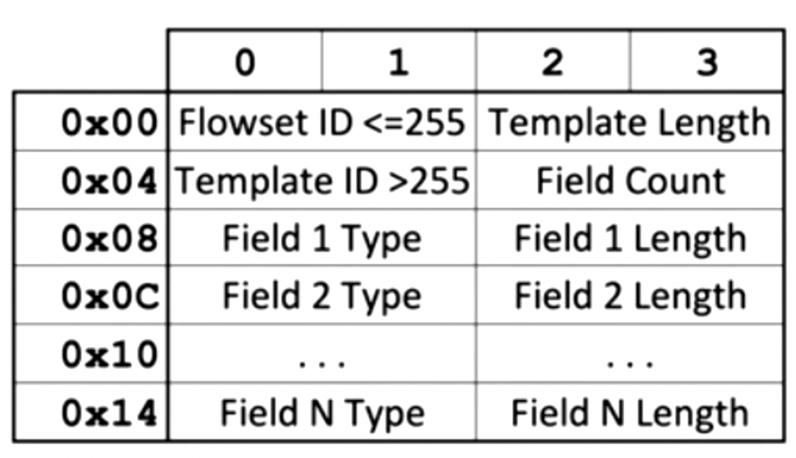

# Off the Disk and Onto the Wire

## Evaluating Web Proxy Data

* Squid nie loguje domyślnie parametrów GET - trzeba to włączyć w konfiguracji `loglevel combined [parametry]`. Przy okazji można też zmienić domyślny format timestampu z epoch.
* Powstały setki tooli do parsowania logów squida[^1], chociaż wydaje się, że bash załatwia sprawę.
* Czasami istotne dowody mogą znajdować się w cache'u proxy. Squid cachuje w `/var/spool/xx/xx/8*hex` i znajduje się tam cała odpowiedź serwera wraz z url i nagłówkami, następnie `CRLF,CRLF/0d0a,0d0a` i treść odpowiedzi.
* Żeby szybko znaleźć odpowiednie pliki można odpalić `grep -rail` czyli taki mix switchy, który wyświetli tylko dopasowania case insensitive ascii (same nazwy plików). Dodatkowo `-F` wyłaczy regexa.

## tcpdump/wireshark refresher

* Timestamp w pcapie to zawsze czas, w którym zaobserwowano pakiet "on the wire".
* Nigdy nie używać formatu pcap-ng, ponieważ jest wciąż "draft standard".
* Wireshark potrafi używać 'passivedns', czyli podstawiać nazwy hostów na podstawie przechwyconych odpowiedzi dns
* Warto zmienić 'time display format' w wiresharku, aby wyświetlało utc zamiast domyślnych 'sekund od początku przechwytywania'.
* Wireshark pozwala na filtrowanie na podst. regexów (`matches`), lub używanie `contains` czy `lower()`.
* Zmieniając w WS wyświetlanie czasu jako interwał pomiędzy poprzednim pakietem pozwala fajnie zaobserwować beaconing.

## Network acquisition

  * Jako, że akwizycja ruchu kosztuje, należy dobrze zdefiniować jej cele, a są nimi odpowiedzi na pytania: 1. Jakie dane wyciekły 2. Aktywność skompromitowanego systemu w trakcie zdarzenia (również bezpośrednio przed i po) 3. Jak malware dostał się do hosta 4. Robienie scopingu z punktu widzenia IOC może się świetnie skalować w kontraście do przeszukiwania IOC na endpointach.
  * ISP ma dużo ciekawych informacji dot. np. wykorzystania C2, ale zdobycie tych informacji wymaga współpracy z law enforcementem.
  * Dobrze jest projektować akwizycje w ramach modernizacji/projektowania sieci, żeby przygotować się na forensic w razie incydentu.
  * ciekawostka - 1gbps przy pełnym wysyceniu wymaga 200TB storage'u dla 24h.

## Network Challenges and Opportunities

* nic ciekawego

# Core Protocols & Log Aggregation/Analysis

## Http Part I: Protocol

* Nie należy zaniedbywać informacji z nagłówka `Accept`, ponieważ może on wskazywać na podrobiony `User-Agent`.
* Również `Accept-Language` może powiedzieć coś o lokalizacji.
* Co do `Accept-Encoding`, wartości `sdcg` czy `sd` wskazują na chrome - ponieważ to własnościowe algorytmy google.
* W odpowiedzi serwera można znaleźć nagłówki `X-Cache` i `X-Cache-Hits: XX`, które wysyła CDN. Pozwalają one ocenić ile razy dana treść była wcześniej serwowana przez konkretny CDN. Możnaby spróbować ocenić ilość ruchu do danego zasobu. Bardzo ciekawe!
* Ciasteczka reklamowe są szalenie ciekawe! Dla przykładu, `__utma` - czyli te od google, oznaczają kolejno: `<HOST HASH>.<COOKIE DB ID>.<FIRST TS>.<PREVIOUS TS>.<CURRENT TS>.<VISIT COUNT>` - czyli przy wizycie na stronie - hash per nazwa domeny, identyfikator bazy danych cookies (trzeba uważać), pierwsza, poprzednia i aktualna wizyta na stronie (timestampy) oraz ilość odwiedzeń witryny.
* `__utmb` - `<HOST HASH>.<PAGES VIEWED THIS SESSION>.<CLICK-OUT COUNT>.<CURRENT TS>` - hasz witryny, ilość otworzonych podstron, ilość wyjść z witryny przez kliknięcie w link, timestamp aktualnej sesji. **UWAGA:** click out to licznik od 10 w dół, co oznacza, że 10 = 0 a 9 = 1, 0 = 10 lub więcej C.O. ...
* `__utmz` - campaign tracker - jak dostano się na stronę. Np. utmcsr="nazwa kampanii, według reklamodawcy" - to może być pomocne przy wykryciu malwaretisingu.
* Ciasteczka reklamowe od "HubSpot" są również ciekawe (i popularne). `__hstc=` - bardzo podobne do google i z bardzo długim czasem życia ciastka. Szczególnie ciekawe `hsfirstvisit=` - zawiera informacje o pierwszym kontakcie z HubSpot globalnie (czas życia ciastka=10 lat).
* Trzeba pamiętać o nagłówku w odpowiedzi http `Transfer-Encoding: chunked`, w tym przypadku body odpowiedzi będzie w kilku porcjach oddzielone wartościami szestnastkowymi oznaczającymi długość porcji. Może to dziwnie wyglądać np. w wiresharku, a w przeglądarce nie będzie widać różnicy. Na końcu body będzie `0`.
* Wspomniany `chunked` **może być wykorzystany do omijania detekcji** podczas przesyłania złośliwego kodu.
* Prawdopodobnie **nie ma obecnie rozwiązań, które stosują reenkrypcję protokołu HTTP/2**. Albo go puszczają, albo downgrade do 1.1.
* HTTP/2 jest w pełni binarny - kompresuje nagłówki.
* HTTP/2 wykorzystuje multipleksacje - można na raz poprosić o wiele zasobów. Serwer ma dowolność czy odpowie pojedyńczo, czy też będzie multipleksował.
* Obsługa pusha też utrudnia dedukcje/forensic - nie ma możliwości ocenić czy pobrany zasób był faktycznie pobarany umyślnie przez kliknięcie, czy wysłany przez serwer.
* Request HTTP/2 wygląda zupełnie inaczej - zamiast nagłówka `Host` jest `:authority:`, zamiast klasycznego `GET / HTTP/1.1` są odpowiednie nagłówki (`:method:`, `:scheme:`, `:path:`).

## Http Part II: Logs

* Standard to NCSA. Po SRC IP, Requesting username jest zawsze `-`, następnie `authenticated username` - tu może pojawić się nazwa użytkownika, jeśli się uwierzytelnił. Następnie time request received, chociaż apache raczej umieszcza czas zakończenia requestu - ważne w przypadku pobierania dużych plików - jeśli request trwa długo. Na końcu jest wielkość odpowiedzi bez nagłówków.
* Combined jest częściej używany i dodatkowo ma `Referer` i `User-Agent`.
* IIS jest oddzielany przecinkami, bytes sent in response - razem z nagłówkami.
* IIS posiada również możliwość zbierania logów w sposób scentralizowany - 'centralized binary logging' lub do ODBC. Można parsować przy użyciu Microsoft Log Parser.
* Można również wykorystywać apache **mod_forensic**. Powoduje dodanie wszystkich nagłówków do logu, oraz POST DATA, ale nie należy traktować tego jako prawdziwy DFIR. Logi można traktować tak jak ruch ze zdjętym TLSem.

## DNS: Protocol and Logs

* DNSy mają bardzo pomysłową kompresje opartą o wskaźniki do porcji informacji wcześniej przesłanych.
* Teoretycznie warto pamiętać o toolu passivedns, który potrafi logować ruch dnsowy na interfejsie lub z jednego lub wielu pcapów - jednak zamiast tego można użyć zeeka.
* Fast-Flux DNS - load balancing oparty na DNSach z krótkim czasem TTL, rozsyła ruch na wiele przejętych hostów, które pośredniczą w komunikacji z C2.
* Fast-Flux DNS (Double) - w tym wariancie, atakujący również ukrywa swój oryginalny DNS za przejętymi hostami co utrudnia jego zablokowanie (DNSa).
* Phased C2 - technika polegająca na zmianie wartości rekordu A w zależności czy aktualnie C2 jest wykorzystywane czy nie.

## Firewall IDS and NSM Logs

* W przypadku *BSD (pf) loguje do `/var/log/pflog` w formacie pcap co umożliwia przeglądanie przy użyciu `tcpdump -nl -r /var/log/pflog 'port 22'`. Poza nagłówkami L3/L4, dostępny jest cały payload (jednak z reguły samego pakietu SYN).

## Logging Protocol and Aggregation

* Syslog pomija rok i strefę czasową w swoim timestampie(!), dlatego w celu weryfikacji tych wartości należy przeszukać logi daemona ntp, które zawierają rok i strefę czasową, która jest skonfigurowana w OSie.
* Boot time, też może pomóc ocenić rok. Nie mylić z czasem kompilacji kernela!
* Facility (pełne anarchonizmów) i severity jest zapisywane w jednej zmiennej całkowitej w następujący sposób:
    * PRI = (facility * 8) + severity
    * facility = floor(PRI / 8), severity = PRI mod 8
* Czasami zmienna PRI jest zapisywana jako pierwszy parametr w logu np. `<190>`.
* Od czasów Visty logi Windowsa można wysyłać lub pobierać przy użyciu Windows Event Forwardingu.
* Należy pamiętać, że część urządzeń sieciowych przechowuje logi w pamięci ulotnej.
* 

## Elastic Stack and the SOFELK Platform

* info dot. platformy - nic ciekawego.

# NetFlow and File Access Protocols

## Netflow Collection and Analysis

* (Net)Flow to krotka 5 wartości: `[srcIP, destIP, L4proto, srcPort, dstPort]`.
* Wersja 5 ogranicza zbieranie informacji do IPv4.
* Netflow wykorzystuje UDP jako transport (z Exportera do Collectora), przy czym każdy datagram może zawierać informacje dot. kilkudziesięciu flowów (czyli utrata jednego datagramu dużo kosztuje).
* Niektóre urządzenia potrafią wykorzystywać SCTP do transportu.


* Version = `00 05` lub `00 09`, Record Count (1-30) i Flow Sequence **pozwalają ocenić czy nastąpiła utrata informacji**.
* **Interval oznacza próbkowanie** Netflowa i może dyskwalifikować go jako źródło informacji DFIRowej.
  


* Uwaga w przypadku ICMP, dstPort oznacza ICMP type.
* srcAS, dstAS oznacza ASN.
* tcpFlags to OR wszystkich widzianych w flow flag, z reguły będzie to `SAPF` (prawidłowo nawiązane i zamknięte połączenie). Można jednak wywnioskować z flag pewne anomalie.




*  Umożliwia wysyłanie dużo większej ilości informacji np. 2 adresów srcIP (w przypadku NATu) - łącznie 87 różnych typów danych.
* Jako, że netflow nie zawiera informacji o zawartości komunikacji (poza metadanymi), trzeba dobrze wnioskować na podstawie charakterystyki ruchu - ilość i długości połączeń, bitrate, kształt wykresu bitrate. Jednak różnica w kształcie wykresu pomiędzy pisaniem komend w ssh a transferem scp wydaje się oczywista.
* Przykładowe charakterystyki połączeń:

| Prot.          | ruch (klient) | ruch (serwer) | Długość poł. | Potencjalna aktywność  |
|----------------|---------------|---------------|--------------|------------------------|
| TCP/80: HTTP   | mały          | duży          | krótko       | typowe pobieranie HTTP |
| TCP/443: HTTPS | duży          | mały          | różnie       | HTTP Post upload/exfil |
| TCP/443: HTTPS | duży          | duży          | długo        | TLS VPN                |
| TCP/22: SSH    | mały          | duży          | różnie       | pobieranie SCP/SFTP    |
| TCP/22: SSH    | różnie        | różnie        | długo        | linia poleceń ssh      |
| TCP/53: DNS    | duży          | duży          | długo        | tunel DNS              |

* trzeba natomiast skonfrontować te wnioski z innymi informacjami takimi jak nazwa dns, cert TLS, intel dot. adresów IP (ASN?).

### OpenSource Flow Tools

* Zbieranie i analiza netflow - w wielkiej skali (ISP) używa się projektu **SiLK**, ale jest raczej niepraktyczny w mniejszej skali.
* Według instruktora dobrym workflowem do DFIRu (jeśli ma się duży pcap) jest wytworzenie z niego netflowa w celu wysokopoziomowego huntingu, a dodatkowo logów zeeka i passivedns na później.
* **nfcapd** - kolektor netflow, sflow, etc. - Odpowiedni do doraźnego DFIRu.
* **nfpcapd** - tworzy netflow na podstawie pcapa.
* **nfdump** `-r plikncapd.xxx 'proto tcp and proto udp'` lub rekursywnie `-R /katalog/z/nf 'src host 1.2.3.4 and dst port 80'`. Dodatkowe switche:
    * `-O tstart` - sort order (first seen).
    * `-o line/long/extended` (output zwykły, z flagami, oraz ze statystykami).
    * statystyki nfdumpa (pps, bps, Bpp) są wyliczane post-factum podczas prezentacji danych.
    * `-o fmt:xxx` pozwala wyświetlać custom output. Np. `-o 'fmt:%ts %te %td'` wyświetla first seen, last seen, duration.
    * `-a` - agregacja (5 tuple) lub `-A` - dowolna agregacja np. `-A srcip,dstport`
    * `-s` - stat/order np. `-s i/bytes -s dstport/bytes -n 5` - wyświetla statystyki TopN.
* Dobrym sposobem szukania **pacjenta zero** jest wykorzystanie `nfdump -R /flowy -t '2018/01/01.18:00:00-2018/01/02.09:00:00' - O tstart -c 1 'proto udp and dst port 8765 and host 123.123.123.123'` - w ten sposób szukamy pierwszego połączenia do `123.123.123.132:8765/udp` i przesuwamy okno czasowe aż znajdziemy pierwszy kontakt.
* Następnie po odnalezieniu pacjenta zero, można zrobić drill-down na jego stacje i obserwować ruch z zainfekowanej stacji.
* Inwestygując komunikacjcę z C2 zawsze należy zwrócić uwagę na netblok/ASN.
* Można przejrzeć komunikacje z całym podejrzanym ASNem w dłuższej perspektywnie czasowej. 

### FTP

* FTP w trybie 'Active' otwiera kolejne połączenia na kolejne nr portów klienta przy następnych komendach wymagających transferu w kanale 'Data'. Nr portu wylicza się w komendzie `PORT IP1,IP2,IP3,IP4,A,B` w następujący sposób: `(A * 256) + B`, inaczej: `(A shl 8) + B`.
* W trybie PASV działanie jest identyczne, przy czym to serwer odsyła 6 wartości i nasłuchuje połączenia przychodzącego. Komenda PASV jest ponawiana.
* RFC 2428 wprowadza komendę EPSV, a z nią IPv6, lepszą obsługę NAT i kończy z shiftem na wartościach portów.
* W tym wypadku sniffowanie samego portu 21/tcp pozwoli jedynie przechwycić kanał kontrolny, sensowniej jest używać filtrów BPF:
    * Active FTP: `tcp and (port 21 or port 20)`
    * Full: `tcp and (port 21 or ((src portrange 1024-65535 or src port 20) and (dst portrange 1024-65535 or dst port 20))`
* Sam kanał data zawiera surowe dane bez metadanych (np. nazwy pliku).

## Microsoft Protocols

* **Outlook**-To-Exchange: korzysta z RPC, część informacji jest XORowane z `0xA5`.
* **SMB** kompatybilność Windowsa:
    * XP/2k/svr2k3 - SMB1.0
    * Vista/svr2k8 - SMB 2.02
    * 7/svr2k8r2 - SMB 2.1
    * 8/svr2012 - SMB 3.0
    * 8.1/svr2012r2 - SMB 3.02
    * 10/svr2016 - SMB 3.1.1
    * Macos na pewno ogarnia min. SMB 3.02 (od Mojave)
    * Samba od 4.3 też SMB3
* Cechy SMBv3: opcjonalnie szyfrowany AES-CCM, opcjononalnie uwierzytelniony AES-CMAC, obsługuje VSS, server failover.
* **SMB jest multipleksowany** i wszystkie operacje/transfery powinny się odbywać wewnątrz 1 poł. TCP.
* Typowe komendy wykorzystywane przy dostępie do plików po SMB:
    * NEGOTIATE, SESSION_SETUP, TREE_CONNECT, CREATE
    * QUERY_DIRECTORY, CREATE
    * READ/WRITE, CLOSE, TREE_DISCONNECT, LOGOFF
* SMB2/3: **Protocol Negiatiation:** Dialect (LANMAN/SMB np. `0x0302`), display filter: `smb.cmd == 0x72 || smb2.cmd == 0`.
* NEGOTIATE_SESSION Response posiada też ciekawy nagłówek dot. uptime'u serwera.
* SMB2/3: **Session Establishment:** Client request wysyła nazwe domenową, username i hostname. Dodatkowo ma miejsce uwierzytelnienie challenge-response "Security Blob".
* W odpowiedzi jest wynik uwierzytelnienia np. `negResult: accept-completed (0)`. Serwer przypisuje Session ID, który odtąd będzie wykorzystywany do identyfikacji - filtr: `smb2.sesid`.
* SMB2/3: **Access Services:** czyli TREE_CONNECT, filtr: `smb2.cmd == 3`. Serwer przypisuje Tree ID: `smb2.tid`, które będzie wykorzystywane do identyfikacji zasobu. Na podstawie TREE_CONNECT można ocenić jaki zasób był eksplorowany np. `\\172.1.2.3\c$` -> `Tree ID: 0x00..01`.
* SMB2/3: **Directory Navigation:** CREATE, filtr: `smb2.cmd == 5`. Pojawia się `Filename` z nazwą zasobu relatywną do `Tree`. Response zawiera **timestampy MACB** i rezultat komendy (`Create Action: the file was opened (1)`). W przypadku sukcesu serwer nadaje `File Id: {GUID}`.
* SMB2/3: **Directory Listing:** QUERY_DIRECTORY filtr: `smb2.cmd == 14`. Częścią requestu jest `File Id` i `Search Pattern: *`. W odpowiedzi poza listingiem otrzymujemy również metadane plików/katalogów takie jak **timestampy MACB**. Wielkość pliku to `End of File: 123` a nie `Allocation Size:`.
* SMB2/3: **Open a File:** CREATE, filtr `smb2.cmd == 5`. Klient wysyła nazwę pliku `smb2.filename`, rodzaj żądanego dostępu (`Share Access: Read/Write/Delete`) i dyspozycje (`File Disposition Open/Create itp.`). Serwer odpowiada z `smb2.fid` (GUID pliku), metadanymi pliku. W odpowiedzi są też **timestampy MACB** i atrybuty pliku.
* SMB2/3: **Read from a File:** READ/WRITE filtr: `smb2.cmd == 8`. Klient wysyła parametr `Read Length` i dostanie w odpowiedzi tylko porcję pliku. W związku z obecnością nagłówków SMB w każdej porcji, **Follow TCP Stream nie pozwoli** w łatwy sposób wyodrębnić pliku ze strumienia.
* SMB2/3: **Close File, Disconnect Tree, Logoff:** CLOSE - `smb2.cmd == 6`, TREE_DISCONNECT - `smb2.cmd == 3`, LOGOFF - `smb2.cmd == 2`. Odwiązuje File ID, Tree ID i Session ID. LOGOFF rzadko się pojawia, bo rzadko ktoś odmontowywuje udział.
* SMB2+ wykorzystuje UTF-16.
* Typowe IoC związane z SMB: 1. komunikacja klient-klient na udziały sieciowe, 2. klient-serwer w nietypowych godzinach, 3. logowanie na to samo konto z różnych maszyn, 4. Enumeracja i pobieranie dużych ilości danych.

# Commercial Tools Wireless and FullPacket Hunting

## SMTP

* W przypadku, kiedy użytkownik wysyła e-mail przy użyciu webmaila, prawdziwym MUA (user-agentem) jest serwer świadczący webmail.
* Porty: `25/tcp` - często wspiera STARTTLS, `587/tcp` - zazwyczaj wspiera STARTTLS, `465/tcp` - zawinięty w TLS.
* W ostatniej fazie wysyłania wiadomości przez SMTP, serwer zwraca komunikat 250, który zawiera `queue ID`. Ten identyfikator ułatwia korelacje wiadomości z kolejką. Ponadto struktura identyfikatora pozwala ujawnić timestamp oraz oprogramowanie MTA i wersje serwera. Czasami ostatnie cyfry to PID MTA.
* Nieszyfrowane uwierzytelnienie SMTP (`AUTH LOGIN` i `AUTH PLAIN`), w pierwszym przypadku serwer wysyła zapytania `Username:` i `Password:` zakodowane b64. W przypadku `AUTH PLAIN`, klient w jednej wiadomości wysyła komplet poświadczeń zakodowanych b64 (`IDENTITY\0USERNAME\0PASSWORD\0`) jedna para USERNAME-PASSWORD może mieć wiele tożsamości (IDENTITY). 
* STARTTLS z reguły spotkać można w SMTP i LDAPie.
* Wysłanie komendy STARTTLS powoduje nawiązanie szyfrowanego połączenia i ponowną negocjacje parametrów SMTP od samego EHLO. W połączeniu szyfrowanym mogą pojawić się metody uwierzytelnienia niedostępne bez szyfrowania np. AUTH LOGIN.

## Commercial Network Forensic Tools

* ten rozdział to dno.

## Wireless Network Forensics

* **BSSID** jest zawsze po jednym na radio.
* Ciekawe, że tryb monitora (RFMON) pozwala nasłuchiwać na **1 częstotliwości** na raz. To może utrudniać nasłuch w trybach wielokanałowych.
* **BSS** - Basic Service Set - obszar, w którym jest dostęp do sieci.
* **DS** - Distribution System - system urządzeń połączonych kablem, świadczących dostęp bezprzedowdowy.
* **ESS** - Extended Service Set - zbiór BSSów połączonych w jeden DS, posiadający nazwę (SSID).
* **WDS** - Wireless Distribution System, jest wykorzystywany w przypadku, kiedy 2 BSSy są połączone ze sobą bezprzewodowo, w celu stworzenia jednego DSu. Czyli w przypadku połączenia 2 zdalnych lokalizacji (rozszerzenia zasięgu). W tym wypadku **ramki 802.11 zawierają 4 mac różne adresy** (źródłowy i docelowy stacji, jak również źródłowy i docelowy BSSów spiętych w jeden WDS). Nie mylić z meshem.


* **Frame type:** 0 - Management (probes/beacons/auth/assoc), 1 - Control (req-to-send, clear-to-send, ack), 2 - Data.
* **MGMT Subtype:** `0x00/1` - Assoc req/resp, `0x02/3` - Reassoc req/resp, `0x04,5` - Probe req/resp, `0x08` - Beacon, `0x09` - ATIM, `0x0a` - dissassoc, `0x0b/c` auth/deauth.
* **Control Subtype:** `0x1b` - Req-to-send, `0x1c` - Clear-to-send, `0x1d` - Ack.
* W przypadku ukrytych SSID (_hidden essid_) przy łączeniu się stacji do AP, **probe response zawiera nazwę sieci**.
* Czasami ramka może zawierać nawet kilobajt tzw. _tagged parameters_.
* Bardzo ciekawym problemem jest to, że nawet w przypadku kiedy **nadawcą ramki kontrolnej jest ktoś z innej sieci**, to jako, że nadaje na tej samej częstotliwości, **musimy honorować wzajmnie kontrolę kolizji**.
* **Data Subtype:** Najistotniejsze `0x0800` _Logical-Link Control Type_ (czyli IP) - tylko te ramki mogą być szyfrowane, decyduje o tym flaga `Security` (1 bit). Szczegóły dot. rodzaju szyfrowania będą zawarte w _tagged parameters_.
* Komunikacja pomiędzy 2 stacjami **zawsze przebiega przez BSS** w trybie Managed. O tym czy kierunek jest do BSS czy od BSS decydują flagi `ToDS` i `FromDS`.

| FromDS | ToDS | Addr1       | Addr2       | Addr3       | Addr4  |
|--------|------|-------------|-------------|-------------|--------|
| 1      | 0    | Destination | BSSID       | Source      | n/a    |
| 0      | 1    | BSSID       | Source      | Destination | n/a    |
| 0      | 0    | Destination | Source      | BSSID       | n/a    |
| 1      | 1    | Receiver    | Transmitter | Destination | Source |

* Warianty w tabelce kolejno: 1. Wired->Wireless, 2. Wireless->Wired, 3. Ad-hoc, 4. WDS.
* Wygląda na to, że nawet **WPA2 nie obsługuje PFSa**.
* W nieszyfrowanej sieci, widać IP (nawet więcej niż IP L2-L7) zaenkapsulowane w Logical-Link Control.
* Główne ataki na Wi-Fi:
    * WPA/WPA2 offline: PSK dictonary attack, online: 1. Forged de-auth, 2. KRACK forced key reuse (nonce reuse).
    * DoS - online: RF/protocol attacks
    * Evil Twin: online: spoofed AP
* WPA2 = RSN (oryginalna nazwa)
* Atak na WPA PSK polega na złamaniu klucza sesyjnego (_session key_), który jest pochodną 6 wartości: 1. SSID, 2. Station + AP MAC, Station + AP nonce, PSK. To wymaga przechwycenia 4-way handshake'a.

## Automated Tools and Libraries

* **libpcap** - wiadomo, **libnids** - reasembluje tcp/ip.
* **tcpflow** używa libnids do ekstrakcji flowów z pcapa. Potrafi też wykonywać postprocessing `-e http`.
* **scapy** można wykorzystać do fuzzowania c2/komunikacji.
* **dshell** - wysokopoziomowy shell dla pcapów do DFIRu.
* **editcap** `plik.pcap -A'data' -B 'data'` - pozwala filtrować pcapy.
* **ngrep** `-q -I plik.pcap 'pattern'` - network grep. Nie wspiera segmentacji.
* **flowgrep[.]py** - łączy tcpflow i ngrep, co umożliwia trafniejsze dopasowanie wzorca. Potrafi zabijać sesje TCP.
* **tcpstat/tcpdstat** - obróbka statystyczna a la vmstat. Potrafi rysować wykresy.
* **ntopng** - nie do DFIRu, statystyki ruchu.
* **tcpxtract** - carver, wyodrębnia pliki ze strumienia/pcapów. Można własne wzorce definiować w konfiguracji. Nie nadaje się do chunked http lub smb, musi być ciągły plik o jasnym nagłówku.

## FullPacket Hunting with Moloch

* Nagrywarka + parser protokołów z możliwościa pobierania pcapów. Od wersji 2.7 nazywa się **Arkime**.
* Tworzy SPI - Session Porfile Information - metadane np. User-Agent, metoda, status http. Te informacje są przyklejane do całej sesji.
* Inna składnia filtrowania `&&, ||, ==`, `==,!=,>`. Np. `host.dns == *google*`, `http.method == POST && host.http == *abc.com`, `tls.cipher == EXISTS! && tls.cipher != *DHE*`
* WISE: pozwala wzbogacać dane poprzez odpytywanie innych serwisów przez API, np. VT.
* Zintegrowany CyberChef.

# Encryption, Protocol Reversing, OPSEC, and Intel

## Encoding Encryption and SSLTLS

* 2 Tryby szyfru strumieniowego - synchroniczny i samo-synchroniczny (self-synchronous) - w tym drugim keystream zależy od szyfrowanych danych (ciphertext). Czyli ciphertext jest xorowany z kluczem (bajt po bajcie).
* Tworzenie hasha: ja3(s): `ja3(s).py -j plik.pcap | jq -c .[]`.
* ja3 - ciphersuites, ja3s - tls ver + cipher suite + extensions.
* serialNumber z certu x509 jest dobrym IOC do robienia sygnatury.
* Można próbować dedukować host z jakim łączy się klient po TLSie na podstawie wcześniejszego zapytania DNS. Należy korelować po adresie IP.
* CN z poziomu tsharka: `tshark -V -n -r plik.pcap -Y 'ssl.handshake.certificates' | grep Certificate:`.

> **Dekrypcja SSL/TLS** w Wireshark gdy brak PFS i dostępny jest klucz RSA:
> **Edit** -> **Preferences**. Open the **Protocols** tree and select **TLS**.

## MeddlerInTheMiddle

* Port stealing - oszukanie switcha (tabeli CAM) wysyłając ramki z nieprawdziwym źródłowym MACiem (ofiary).
* UDP "first response wins" - polega na tym, że brak jakiegokolwiek uwierzytelnienia/nr sekwencyjnego/handshakeu sprawia, że klient uwierzy pierwszemu datagramowi UDP jaki otrzyma w odpowiedzi bez weryfikacji nadawcy. Ewentualna mitygacja wymaga implementacji mechanizmu L7. Szczególnie podatny DNS, wystarczy podsłuchać polę `uint16 TransID`. Ten rodzaj ataku zostanie wykryty przez Zeeka (unrequested dns response).

## Network Protocol Reverse Engineering

* Do **atrybutów porotkołu** (_Protocol Attributes_) zalicza się: 1. strukturę 2. przpływ (flow) 3. enkapsulacje 4. funkcjonalność 5. kodowanie/szyfrowanie.
* Do inżynierii wstecznej protokołu sieciowego wymagamy co najmniej jednego z: 1. binarka lub kod klienta, 2. binarka lub kod serwera, 3. przechwycony ruch sieciowy.

## Investigation OPSEC and Threat Intel

* Należy uważać z zapytaniami DNS do infrastruktury adwersarza - to może ujawnić aktywność incident respondera.
* Ciekawy kejs z PeopleSoft, gdzie faktura za usługi IR może być zarejestrowana w systemie i widziana przez adwersarza.
* Możemy w uproszczeniu przyjąć, że jeśli nie możemy już znaleźć nowych IOC to czas skończyć fazę scopingu. Alternatywnie jeśli adwersarz rozpocznie bardzo niebezpieczną akcję.
* Należy również pamiętać o dhcp/dns/mdsn/upnp, które ujawnia obecność incident respondera w sieci LAN.
* Według instruktora zniszczenie infrastruktury Sony było na skutek tego, że napastnik był świadom działania zespołu IR.
* DFIR po przywróceniu systemu z ataku ransowmare może być koszmarem ze względu na zniszczony materiał dowodowy.

# Luźny cheatsheet

## jq

* wydobycie samego ja3 z jsona: `| jq .[].ja3_digest`

## tcpflow

* ekstraktor http: `topflow -e http -r plik.pcap` - utworzony flow można sprawdzić `file *BODY*` i powinien zawierać zdekodowany plik (jeśli pobierano). 

## Zeek

* Właczenie hashowania plików: `zeek -C -r file.pcap policy/frameworks/files/hash-all-files.zeek`.
* Włączenie dumpowania x509: `policy/protocols/ssl/log-certs-base64.zeek`.
* Logowanie json: `policy/tuning/json-logs.zeek`

### Przykładowa Sygnatura

```
signature potential-c2 {
	ip-proto == tcp
	tcp-state established
	payload /.*ULQENP2.*/
	event "Found potential C2 traffic"
}
```

## tshark

* filtrowanie po cookie 'utm': `-Y 'http.cookie contains "utm" and http.host contains "abc.com"'`.
* statystyka ruchu: `tshark -q -r stark-20120403-full-smb_smb2.pcap -z ip_hosts,tree`.

### inspekcja certyfikatów x509 (SAN)

```bash
tshark -n -r ssl.pcap -Y 'ssl.handshake.certificate' \
-T fields -E separator=\| -E aggregator=\| \
-e x509ce.dNSName -e x509sat.teletexString -e x509sat.IA5String \
| tr -s \| '\n' | sort | uniq -c | sort -nr
```

### trik na wylistowanie strumieni TCP, które zawierają np. konkretny certyfikat

```bash
tshark -n -r plik.pcap -T fields -e tcp.stream \
-Y 'x509ce. dNSName==abc.com or
    x509sat.teletexString==abc.com or
    x509sat.uTF8String==abc.com or
    x509sat.universalString==abc.com or
    x509sat.IA5String==abc.com' 
```

* redukcja pcapa na podstawie tych strumieni:

```bash
tshark -n -r plik.pcap -Y 'tcp.stream==2717 or tcp.stream==2719' \
    -w inny.pcap
```

### inne

```bash
tshark -n -C no_desegment_tcp -r plik.pcap -T fields \
-e frame.time_delta._displayed -e http.request.uri \
-Y 'http.user_agent contains "MSIE 8.0" and http.request.uri contains "sugexp"'
```

## SOF-ELK

* IP range: `source_ip:[172.16.0.0 TO 172.16.255.255]`, `-source_ip:[x TO y]`.
* flagi tcp (nf): `tcpflags:*R*`.
  
[^1]: [calamaris](https://calamaris.cord.de), [sarg](https://sarg.sourceforge.net), [squidview](https://rillion.net/squidview) i wiele innych
